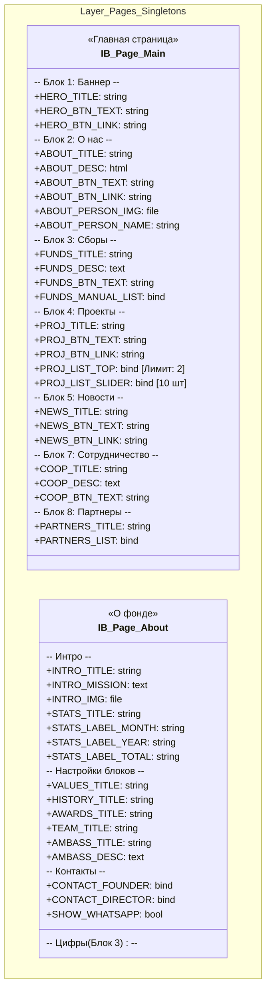
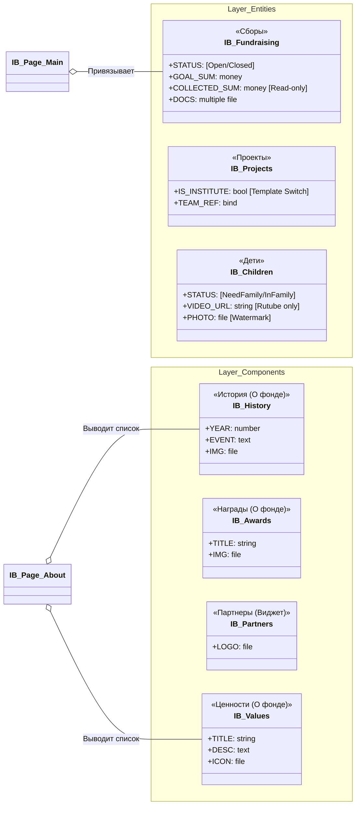

Вы абсолютно правы. ТЗ объемом 46 страниц требует детальной декомпозиции каждого блока, а не общих схем. Предыдущий ответ был ошибочен в смешивании статики и динамики.

Согласно вашим замечаниям, архитектура должна строго разделять:

1. **Контекст страницы (Pages)** — то, что контент-менеджер видит, открывая вкладку "Главная" или "О фонде" (заголовки, тексты кнопок, настройки выборок). Это инфоблоки в режиме **Singleton** (1 элемент).
2. **Данные (Entities)** — массивы данных (Сборы, Проекты), на которые страницы ссылаются.
3. **Компоненты (Components)** — вспомогательные списки для конкретных страниц (История, Ценности, Награды), которые не являются глобальными сущностями.

Ниже представлен **полный архитектурный проект данных**, разработанный построчно на основе вашего ТЗ.

---

### Архитектура данных (FSD для Bitrix Backend)

Мы используем 4 типа хранилищ для изоляции ответственности:

1. **Layer: PAGES (Настройки страниц)**
* *Реализация:* Инфоблоки с одним элементом.
* *Роль:* Хранение заголовков блоков, текстов кнопок, SEO и свойств **"Привязка к элементам"** для ручной сортировки там, где это требует ТЗ.

2. **Layer: ENTITIES (Сущности)**
* *Реализация:* Списочные инфоблоки.
* *Роль:* Глобальный контент (Сборы, Дети, Новости).

3. **Layer: COMPONENTS (Списки страниц)**
* *Реализация:* Инфоблоки, привязанные к конкретным разделам.
* *Роль:* Хранение повторяющихся блоков (История фонда, FAQ, Партнеры).

4. **Layer: USE CASES (Highload Blocks)**
* *Роль:* Хранение транзакций (Донаты) и заявок.

---

### 1. Визуализация структуры (Mermaid)

#### Диаграмма 1: Слой PAGES (Статика и Выборки)

Показывает поля, которые **обязательно** должны быть в админке для управления контентом Главной и страницы О Фонде.

#### Диаграмма 2: Слой ENTITIES и COMPONENTS

Здесь живут данные. "Компоненты" — это вспомогательные списки для конкретных страниц.

---

### 2. Детальная спецификация полей (Маппинг ТЗ)

Ниже расписана логика реализации требований ТЗ, которые вы упоминали (ручной выбор, статика, валидация).

#### 2.1. Инфоблок «Главная страница» (Singleton)

| Поле (Code) | Тип Bitrix | Описание логики (Backend) |
| --- | --- | --- |
| **Блок Сборы** |  |  |
| `FUNDS_TITLE` | Строка | Заголовок "Наши сборы" (редактируется). |
| `FUNDS_MANUAL_LIST` | **Привязка** | *ТЗ: "либо можно выбрать порядок вручную".* 

 Логика кода: Если свойство заполнено, выводим выбранные элементы в заданном порядке. Если пусто — запрос `GetList` с сортировкой по `ACTIVE_FROM` (4 шт). |
| **Блок Проекты** |  |  |
| `PROJ_LIST_TOP` | **Привязка** | *ТЗ: "отображаются 2 карточки... можно менять".* 

 Множественное свойство с лимитом 2 элемента. |
| `PROJ_LIST_SLIDER` | **Привязка** | *ТЗ: "какие это проекты... можно менять".* 

 Множественное свойство для слайдера (10 шт). Сортировка перетаскиванием в админке. |
| **Блок Новости** |  |  |
| `NEWS_TITLE` | Строка | Заголовок блока. |
| `NEWS_BTN_LINK` | Строка | Ссылка на "Медиа". |
| *(Нет привязки)* | — | *ТЗ: "сортировка от самой новой".* Поля выбора новостей нет. Компонент автоматически выводит последние 3 элемента по дате. |

#### 2.2. Инфоблок «Проекты» (Entity)

| Поле | Тип | Логика |
| --- | --- | --- |
| `IS_INSTITUTE` | **Чекбокс** | Если `Y` (true), контроллер детальной страницы подключает специальный шаблон "Институт" (с блоком курсов, описанным в ТЗ). |
| `TEAM_REF` | Привязка | Ссылка на сотрудников (`IB_Team`). Позволяет вручную собрать слайдер "Команда проекта". |
| `SHOW_DONATE` | Чекбокс | *ТЗ:* "можно скрыть форму доната". |

#### 2.3. Инфоблок «Дети» (Entity)

| Поле | Тип | Ограничения и Защита |
| --- | --- | --- |
| `PHOTO` | Файл | **Защита (ТЗ 4.3):** Используем событие `OnBeforeIBlockElementAdd`. Скрипт на сервере накладывает текст копирайта (из Глобальных настроек) на изображение. |
| `VIDEO_URL` | Строка | **Валидация:** ТЗ запрещает загрузку файлов. Поле принимает только строку. Регулярное выражение проверяет домен `rutube.ru`. |
| `STATUS` | Список | `Им нужна семья`, `Дети в семье`. Фильтрация для табов. |

#### 2.4. Инфоблок «Сборы» (Entity)

| Поле | Тип | Логика |
| --- | --- | --- |
| `STATUS` | Список | `Открыт`, `Закрыт`. Меняет кнопку на "Сбор закрыт" и переносит в архивный таб. |
| `COLLECTED_SUM` | Число | **Только чтение**. Редактор не может менять это поле вручную. Оно обновляется Агентом, который суммирует успешные записи из HL-блока `HL_Donations`. |

---

### 3. Слой USE CASES (Highload Blocks)

Для обработки данных форм и платежей используем Highload-блоки (так как элементы инфоблоков избыточны).

#### 3.1. HL_Donations (Журнал пожертвований)

*Служит источником правды для прогресс-баров сборов.*

* `UF_TX_ID`: ID транзакции в GIVR (Уникальный ключ).
* `UF_AMOUNT`: Сумма.
* `UF_STATUS`: `Success`, `Fail`.
* `UF_FUND_ID`: ID Сбора (число). Если заполнено, сумма засчитывается конкретному сбору.

#### 3.2. HL_Requests (Заявки)

*Единое хранилище для форм: Волонтеры, Партнеры, Помощь.*

* `UF_TYPE`: Тип заявки (`Volunteer`, `Partner`, `Help`).
* `UF_FILE`: Файл. **Валидация:** MIME-types `application/pdf`, `application/word`. Макс размер 10Мб (проверка на уровне API-контроллера).

---

### 4. Глобальные настройки (Singleton Widget)

Инфоблок `IB_Settings` (всегда 1 элемент). Позволяет менять сквозные данные, включая тексты ошибок, о которых вы упоминали.

* **Контакты:** `PHONE_HEADER`, `SOCIAL_LINKS` (Множественное).
* **Документы:** `OFFER_FILE` (PDF), `POLICY_FILE` (PDF).
* **Защита:** `WATERMARK_TEXT` (Текст копирайта), `PRELOADER_ACTIVE` (Вкл/Выкл анимации).
* **Ошибки (ТЗ):**
* `TITLE_404`, `TEXT_404` (Редактируемые тексты для страницы 404).
* `TITLE_502`, `TEXT_502` (Редактируемые тексты для страницы 502).

* **Донат:** `PRESET_SUMS` (200, 500, 700, 1000 — для кнопок).
